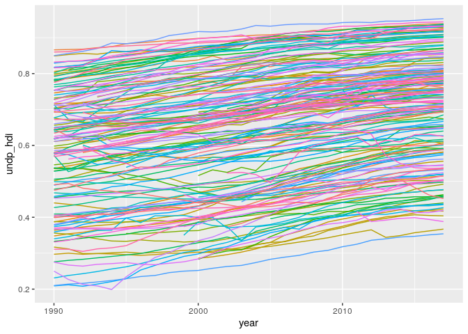

<!-- README.md is generated from README.Rmd. Please edit that file -->

# rqog-package: download data from the Quality of Government Institute data

<!-- badges: start -->

[](https://www.tidyverse.org/lifecycle/#maturing)
[](https://CRAN.R-project.org/package=rqog)
<!-- badges: end -->

Download the latest and archived datasets from the [Quality of
Government Institute](https://qog.pol.gu.se/data) using the function
`read_qog()`. See
[`?read_qog`](http://ropengov.github.io/rqog/reference/read_qog.html)
for help, [package
vignette](http://ropengov.github.io/rqog/articles/rqog_tutorial.html)
for more examples and
[data.markuskainu.fi/qog/](http://data.markuskainu.fi/qog/index.html)
for interactive metadata.

## Installation

``` r
devtools::install_github("ropengov/rqog")
```

## Use

**Download data**

``` r
library(rqog)
dat <- read_qog(which_data = "standard", data_type = "time-series")
```

**Browse metadata**

``` r
library(rqog)
meta_std_ts_2021[grepl("human development", meta_std_ts_2021$name, ignore.case = TRUE),]
#> # A tibble: 2 x 5
#>   code     name                    value label class  
#>   <chr>    <chr>                   <dbl> <chr> <chr>  
#> 1 iiag_hd  Human Development          NA <NA>  numeric
#> 2 undp_hdi Human Development Index    NA <NA>  numeric
```

**Plot an indicator**

``` r
library(ggplot2)
ggplot(dat[!is.na(dat$undp_hdi),], 
       aes(x = year, y = undp_hdi, color = cname)) + 
  geom_line() + 
  theme(legend.position = "none")
```



Copyright (C) 2012-2021 Markus Kainu <markuskainu@gmail.com>.
MIT-licence.

## Disclaimer

This package is in no way officially related to or endorsed by Quality
of Government Institute.
