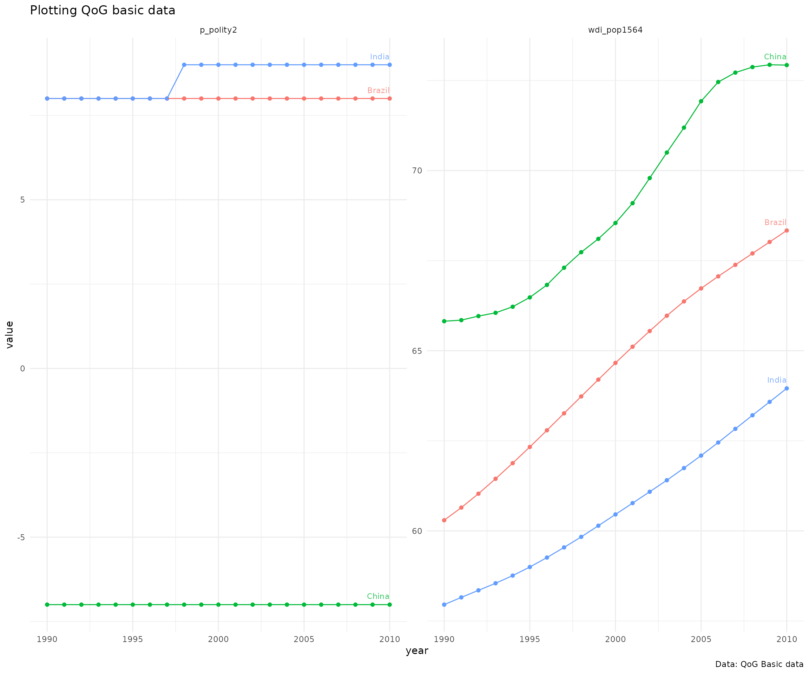
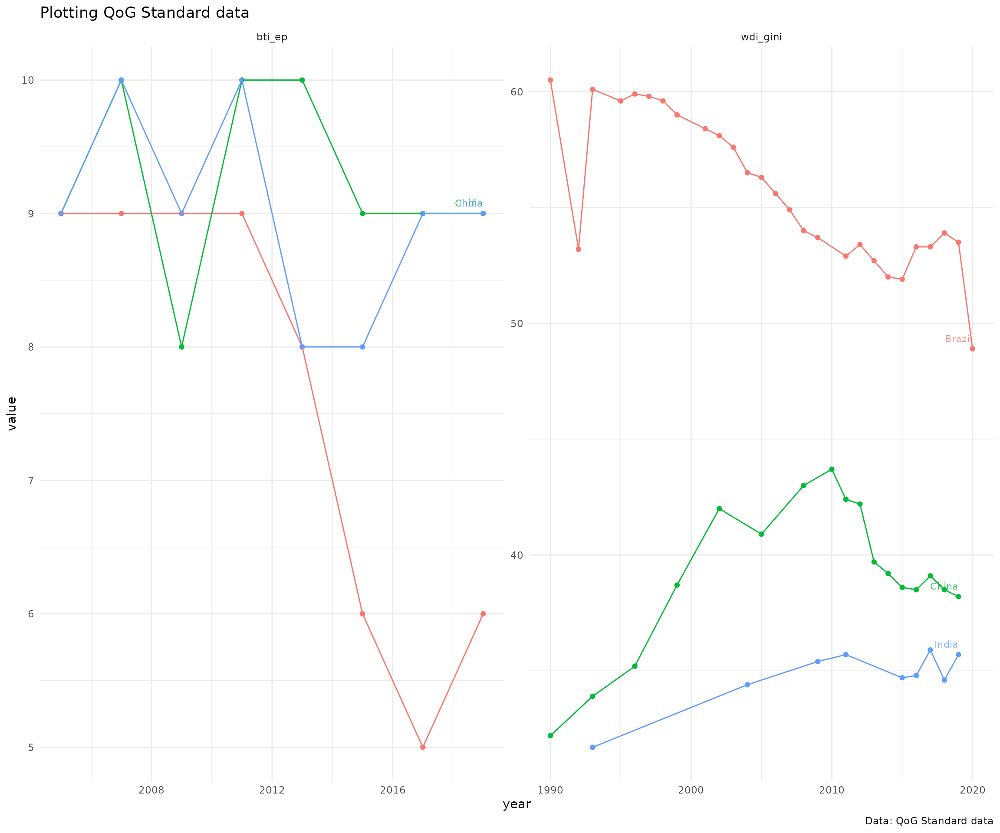
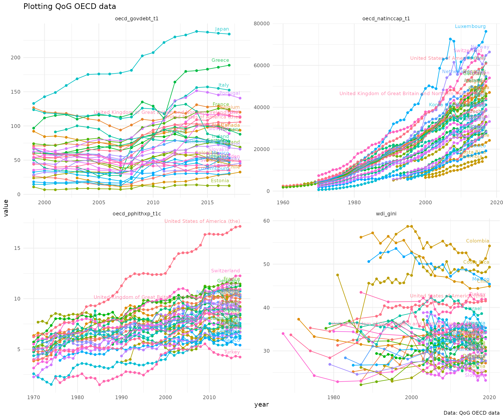
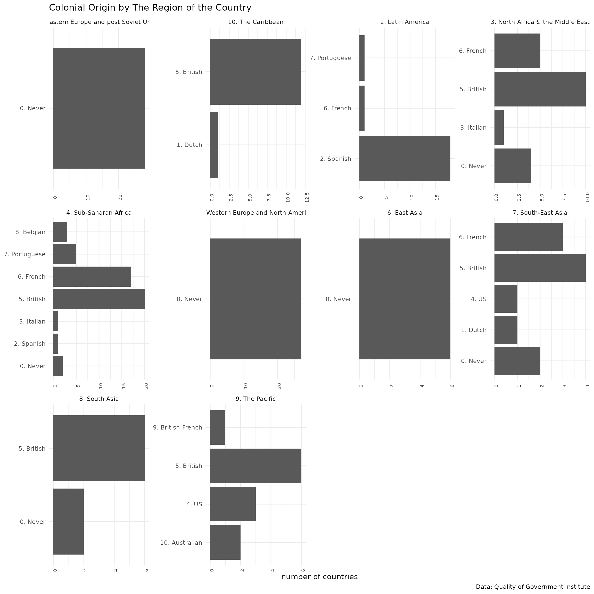

# rqog-package for R

`compiled at` 2026-03-10 15:17:15.000384

*Download data from the Quality of Government Institute data*

Quotation from [Quality of Governance institute
website](http://www.qog.pol.gu.se/)

> The QoG Institute was founded in 2004 by Professor Bo Rothstein and
> Professor Sören Holmberg. It is an independent research institute
> within the Department of Political Science at the University of
> Gothenburg. We conduct and promote research on the causes,
> consequences and nature of Good Governance and the Quality of
> Government (QoG) - that is, trustworthy, reliable, impartial,
> uncorrupted and competent government institutions.

> The main objective of our research is to address the theoretical and
> empirical problem of how political institutions of high quality can be
> created and maintained. A second objective is to study the effects of
> Quality of Government on a number of policy areas, such as health, the
> environment, social policy, and poverty. We approach these problems
> from a variety of different theoretical and methodological angles.

**Quality of Government institute** provides data in five different data
sets, both in cross-sectional and longitudinal versions:

1.  [QoG Basic
    Data](http://www.qog.pol.gu.se/data/datadownloads/qogbasicdata/)
2.  [QoG Standard
    Data](http://www.qog.pol.gu.se/data/datadownloads/qogstandarddata/)
3.  [QoG OECD Data](http://qog.pol.gu.se/data/datadownloads/qogoecddata)
4.  [QoG Expert Survey
    Data](http://www.qog.pol.gu.se/data/datadownloads/qogexpertsurveydata/)
5.  [QoG EU Regional
    Data](http://www.qog.pol.gu.se/data/datadownloads/qogeuregionaldata/)

**rqog**-package provides access to **Basic**, **Standard** and **OECD**
datasets through function [`read_qog()`](../reference/read_qog.md).
**Standard** data has all the same indicators as in **Basic** data (367
variables) and an additional ~1600 indicators. Both **basic** and
**standard** datasets have 194 countries. **OECD** dataset has 1020
indicators from 35 countries. **rqog** uses *longitudinal* datasets by
default that have time-series of varying duration from majority of the
indicators and countries.

Quality of Government Institute provides codebooks for all datasets:

1.  [Basic data
    codebook](http://www.qogdata.pol.gu.se/data/qog_bas_jan18.pdf)
2.  [Standard data
    codebook](http://www.qogdata.pol.gu.se/data/qog_std_jan18.pdf)
3.  [OECD data
    codebook](http://www.qogdata.pol.gu.se/data/qog_oecd_jan18.pdf)

You consult the codebooks for description of the data and indicators.

## Installation

``` r
library(devtools)
install_github("ropengov/rqog")
library(rqog)
```

## Examples

### Download data and plot numeric indicators

**Basic Data**

Basic data has a selection of most common indicators, 344 indicators
from 211 countries. Below is an example on how to extract data on
population and Democracy (Freedom House/Polity) index from
BRIC-countries from 1990 to 2010 and to plot it.

``` r
library(rqog)
library(dplyr)
library(ggplot2)
library(tidyr)
# Download a local coppy of the file
basic <- read_qog(which_data="basic", data_type = "time-series")
# Subset the data
dat.l <- basic %>% 
  # filter years and countries
  filter(year %in% 1990:2010,
         cname %in% c("Russia","China","India","Brazil")) %>% 
  # select variables
  select(cname,year,p_polity2,wdi_pop1564) %>% 
  # gather to long format
  gather(., var, value, 3:4) %>% 
  # remove NA values
  filter(!is.na(value))

# Plot
ggplot(dat.l, aes(x=year,y=value,color=cname)) + 
  geom_point() + geom_line() +
  geom_text(data = dat.l %>% 
              group_by(cname) %>% 
              filter(year == max(year)),
          aes(x=year,y=value,label=cname),
          hjust=1,vjust=-1,size=3,alpha=.8) +
  facet_wrap(~var, scales="free") +
  theme_minimal() +  
  theme(legend.position = "none") +
  labs(title = "Plotting QoG basic data",
       caption = "Data: QoG Basic data")
```



**Standard data**

Standard data includes 2190 indicators from 211 countries. Below is an
example on how to extract data on *Economic Performance* and *GINI index
(World Bank estimate)* from BRIC-countries and plot it.

``` r
library(rqog)
# Download a local coppy of the file
standard <- read_qog("standard", "time-series")
# Subset the data
dat.l <- standard %>% 
  # filter years and countries
  filter(year %in% 1990:2020,
         cname %in% c("Russia","China","India","Brazil")) %>% 
  # select variables
  select(cname,year,bti_ep,wdi_gini) %>% 
  # gather to long format
  gather(., var, value, 3:4) %>% 
  # remove NA values
  filter(!is.na(value))

# Plot the data
# Plot
ggplot(dat.l, aes(x=year,y=value,color=cname)) + 
  geom_point() + geom_line() +
  geom_text(data = dat.l %>% 
              group_by(cname) %>% 
              filter(year == max(year)),
          aes(x=year,y=value,label=cname),
          hjust=1,vjust=-1,size=3,alpha=.8) +
  facet_wrap(~var, scales="free") +
  theme_minimal() +  
  theme(legend.position = "none") +
  labs(title = "Plotting QoG Standard data",
       caption = "Data: QoG Standard data")
```



**OECD data**

OECD data includes 1006 variables, but from a smaller number of
wealthier countries of 36. In the example below four indicators:

1.  Total expenditure on health `oecd_pphlthxp_t1c`
2.  Income inequality: GINI index (World Bank estimate) `wdi_gini`
3.  Gross National Income per Capita `oecd_natinccap_t1`
4.  Adjusted general government debt-to-GDP (excl. unfunded pension
    liability) `oecd_govdebt_t1`

We will include all the countries and all the years included in the
data.

``` r
library(rqog)
# Download a local coppy of the file
oecd <- read_qog("oecd", "time-series")
# Subset the data
dat.l <- oecd %>% 
  # select variables
  select(cname,year,oecd_pphlthxp_t1c,wdi_gini,oecd_natinccap_t1,oecd_govdebt_t1) %>% 
  # gather to long format
  gather(., var, value, 3:6) %>% 
  # remove NA values
  filter(!is.na(value))

# Plot the data
# Plot
ggplot(dat.l, aes(x=year,y=value,color=cname)) + 
  geom_point() + geom_line() +
  geom_text(data = dat.l %>% 
              group_by(var,cname) %>% 
              filter(year == max(year)),
          aes(x=year,y=value,label=cname),
          hjust=1,vjust=-1,size=3,alpha=.8) +
  facet_wrap(~var, scales="free") +
  theme_minimal() +  
  theme(legend.position = "none") +
  labs(title = "Plotting QoG OECD data",
       caption = "Data: QoG OECD data")
```



### Work with metadata and factor indicators

Packages is shipped with seven metadatas for each year (2016-2022)
`meta_basic_cs_2022`, `meta_basic_ts_2022`, `meta_std_cs_2022`,
`meta_std_ts_2022`, `meta_oecd_cs_2022` and `meta_oecd_ts_2022`. Data
frames are generated from original `spss` versions of data using
`tidymetadata::create_metadata()`-function.

**Browsing metadata**

You can browse the content by applying `grepl` to `name` column. Let’s
find indicators containing term `Corruption` either in lower or
uppercase.

``` r
library(rqog)
meta_basic_ts_2022[grepl("Corruption", meta_basic_ts_2022$name, ignore.case = TRUE),]
```

    ## # A tibble: 10 × 5
    ##    code       name                                             value label class
    ##    <chr>      <chr>                                            <dbl> <chr> <chr>
    ##  1 bci_bci    The Bayesian Corruption Indicator                   NA NA    nume…
    ##  2 ccp_cc     Corruption Commission Present in Constitution        1 1. Y… fact…
    ##  3 ccp_cc     Corruption Commission Present in Constitution        2 2. No fact…
    ##  4 ccp_cc     Corruption Commission Present in Constitution       90 90. … fact…
    ##  5 ccp_cc     Corruption Commission Present in Constitution       96 96. … fact…
    ##  6 ccp_cc     Corruption Commission Present in Constitution       97 97. … fact…
    ##  7 ti_cpi     Corruption Perceptions Index                        NA NA    nume…
    ##  8 vdem_corr  Political corruption index                          NA NA    nume…
    ##  9 wbgi_cce   Control of Corruption, Estimate                     NA NA    nume…
    ## 10 wdi_tacpsr CPIA transparency-accountability-corruption in …    NA NA    nume…

**Assigning labels to values with metadata**

The data `rqoq` imports to R is in `.csv`-format without the labels and
names shipped together with `spss` or `Stata` formats. As such it is the
desired format to work with in R, especially with numeric indicators.
However, many of the indicators in QoG are factors meaning that they
have discrete values with a corresponding label. You can use the
metadatas to assign labels for values of such indicators. Lets take the
`ccp_cc` as an example below and first print the `value` and `label`
colums of the data.

``` r
meta_basic_ts_2022 %>% filter(code == "ccp_cc") %>% select(value,label)
```

    ## # A tibble: 5 × 2
    ##   value label                                  
    ##   <dbl> <chr>                                  
    ## 1     1 1. Yes                                 
    ## 2     2 2. No                                  
    ## 3    90 90. left explicitly to non-constitution
    ## 4    96 96. Other                              
    ## 5    97 97. Unable to determine

Currently we have basic data in R in an object called `basic`. Lets see
the frequencies of each value

``` r
basic %>% count(ccp_cc)
```

    ##   ccp_cc    n
    ## 1      1  527
    ## 2      2 8999
    ## 3     96  253
    ## 4     NA 5587

Now, using the metadata with assign values with corresponding labels

``` r
basic %>% 
  count(ccp_cc) %>% 
  mutate(ccp_cc_lab = meta_basic_ts_2022[meta_basic_ts_2022$code == "ccp_cc",]$label[match(ccp_cc,meta_basic_ts_2022[meta_basic_ts_2022$code == "ccp_cc",]$value)])
```

    ##   ccp_cc    n ccp_cc_lab
    ## 1      1  527     1. Yes
    ## 2      2 8999      2. No
    ## 3     96  253  96. Other
    ## 4     NA 5587       <NA>

So, lets find two factor variables with few more values from the
*cross-sectional* data

``` r
meta_basic_cs_2022 %>% 
  filter(class =="factor") %>% 
  group_by(code) %>% 
  summarise(n_of_values = n()) %>% 
  arrange(desc(n_of_values))
```

    ## # A tibble: 20 × 2
    ##    code         n_of_values
    ##    <chr>              <int>
    ##  1 gol_pr                28
    ##  2 gol_est_spec          12
    ##  3 ht_colonial           11
    ##  4 ht_region             10
    ##  5 cpds_tg                7
    ##  6 ccp_slave              6
    ##  7 ccp_cc                 5
    ##  8 ccp_childwrk           5
    ##  9 ccp_equal              5
    ## 10 ccp_freerel            5
    ## 11 gd_ptsa                5
    ## 12 gd_ptsh                5
    ## 13 lp_legor               5
    ## 14 ccp_strike             4
    ## 15 fhn_fotnst             3
    ## 16 gol_est                3
    ## 17 nelda_mbbe             3
    ## 18 nelda_mtop             3
    ## 19 nelda_oa               3
    ## 20 nelda_rpae             3

Lets take these two factors and summarise the regime types per regions

``` r
meta_basic_cs_2022 %>% 
  filter(code %in% c("ht_region","ht_colonial")) %>% 
  distinct(code, .keep_all = TRUE)
```

    ## # A tibble: 2 × 5
    ##   code        name                      value label                        class
    ##   <chr>       <chr>                     <dbl> <chr>                        <chr>
    ## 1 ht_colonial Colonial Origin               0 0. Never colonized by a Wes… fact…
    ## 2 ht_region   The Region of the Country     1 1. Eastern Europe and post … fact…

``` r
# lets download the cross-sectional data first
basic_cs <- read_qog(which_data = "basic", data_type = "cross-sectional")

plot_d <- basic_cs %>% 
  # group by region
  group_by(ht_region) %>% 
  # count per group frequencies of each regime type
  count(ht_colonial) %>%
  ungroup() %>% 
  # label
  mutate(ht_region_lab = meta_basic_ts_2022[meta_basic_ts_2022$code == "ht_region",]$label[match(ht_region,meta_basic_ts_2022[meta_basic_ts_2022$code == "ht_region",]$value)],
         ht_colonial_lab = meta_basic_ts_2022[meta_basic_ts_2022$code == "ht_colonial",]$label[match(ht_colonial,meta_basic_ts_2022[meta_basic_ts_2022$code == "ht_colonial",]$value)]) %>% 
  na.omit()
head(plot_d)
```

    ## # A tibble: 6 × 5
    ##   ht_region ht_colonial     n ht_region_lab                      ht_colonial_lab
    ##       <int>       <int> <int> <chr>                              <chr>          
    ## 1         1           0    28 1. Eastern Europe and post Soviet… 0. Never colon…
    ## 2         2           2    18 2. Latin America                   2. Spanish     
    ## 3         2           6     1 2. Latin America                   6. French      
    ## 4         2           7     1 2. Latin America                   7. Portuguese  
    ## 5         3           0     4 3. North Africa & the Middle East  0. Never colon…
    ## 6         3           3     1 3. North Africa & the Middle East  3. Italian

``` r
# lets abbreviate option '0. Never colonized by a Western overseas colonial power' to '0. Never'
plot_d$ht_colonial_lab[plot_d$ht_colonial_lab == "0. Never colonized by a Western overseas colonial power"] <- '0. Never'
```

Then we can create a simple bar plot

``` r
# indicators names from metadata
ind_name <- unique(meta_basic_cs_2022[meta_basic_cs_2022$code == "ht_colonial",]$name)
group_name <- unique(meta_basic_cs_2022[meta_basic_cs_2022$code == "ht_region",]$name)

ggplot(plot_d, aes(x=ht_colonial_lab,y=n)) + 
  geom_col() + 
  facet_wrap(~ht_region_lab, scales = "free") + 
  theme_minimal() + theme(axis.text.x = element_text(angle = 90, size = 7)) +
  labs(title = paste0(ind_name," by ",group_name ), 
       caption = "Data: Quality of Government institute", x = NULL, y = "number of countries") +
  coord_flip()
```



``` r
sessionInfo()
```

    ## R version 4.5.2 (2025-10-31)
    ## Platform: x86_64-pc-linux-gnu
    ## Running under: Ubuntu 24.04.3 LTS
    ## 
    ## Matrix products: default
    ## BLAS:   /usr/lib/x86_64-linux-gnu/openblas-pthread/libblas.so.3 
    ## LAPACK: /usr/lib/x86_64-linux-gnu/openblas-pthread/libopenblasp-r0.3.26.so;  LAPACK version 3.12.0
    ## 
    ## locale:
    ##  [1] LC_CTYPE=C.UTF-8       LC_NUMERIC=C           LC_TIME=C.UTF-8       
    ##  [4] LC_COLLATE=C.UTF-8     LC_MONETARY=C.UTF-8    LC_MESSAGES=C.UTF-8   
    ##  [7] LC_PAPER=C.UTF-8       LC_NAME=C              LC_ADDRESS=C          
    ## [10] LC_TELEPHONE=C         LC_MEASUREMENT=C.UTF-8 LC_IDENTIFICATION=C   
    ## 
    ## time zone: UTC
    ## tzcode source: system (glibc)
    ## 
    ## attached base packages:
    ## [1] stats     graphics  grDevices utils     datasets  methods   base     
    ## 
    ## other attached packages:
    ## [1] tidyr_1.3.2   ggplot2_4.0.2 dplyr_1.2.0   rqog_0.4.2023
    ## 
    ## loaded via a namespace (and not attached):
    ##  [1] gtable_0.3.6       jsonlite_2.0.0     compiler_4.5.2     tidyselect_1.2.1  
    ##  [5] jquerylib_0.1.4    scales_1.4.0       systemfonts_1.3.2  textshaping_1.0.5 
    ##  [9] yaml_2.3.12        fastmap_1.2.0      readxl_1.4.5       R6_2.6.1          
    ## [13] labeling_0.4.3     generics_0.1.4     knitr_1.51         htmlwidgets_1.6.4 
    ## [17] forcats_1.0.1      tibble_3.3.1       desc_1.4.3         RColorBrewer_1.1-3
    ## [21] bslib_0.10.0       pillar_1.11.1      rlang_1.1.7        utf8_1.2.6        
    ## [25] cachem_1.1.0       xfun_0.56          S7_0.2.1           fs_1.6.7          
    ## [29] sass_0.4.10        cli_3.6.5          withr_3.0.2        pkgdown_2.2.0     
    ## [33] magrittr_2.0.4     digest_0.6.39      grid_4.5.2         haven_2.5.5       
    ## [37] hms_1.1.4          lifecycle_1.0.5    vctrs_0.7.1        evaluate_1.0.5    
    ## [41] glue_1.8.0         farver_2.1.2       cellranger_1.1.0   ragg_1.5.1        
    ## [45] purrr_1.2.1        rmarkdown_2.30     tools_4.5.2        pkgconfig_2.0.3   
    ## [49] htmltools_0.5.9
