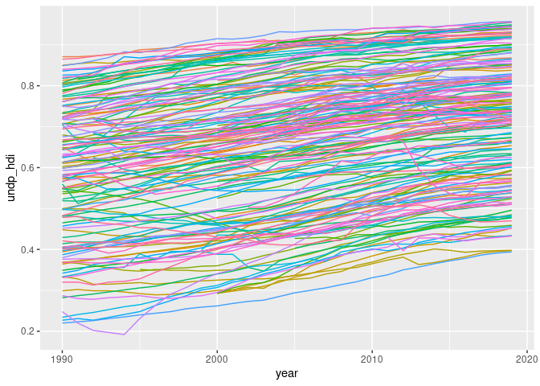

# rqog-package: download data from the Quality of Government Institute data

Download the latest and archived datasets from the [Quality of
Government Institute](https://qog.pol.gu.se/data) using the function
[`read_qog()`](reference/read_qog.md). See
[`?read_qog`](http://ropengov.github.io/rqog/reference/read_qog.md) for
help, [package
vignette](http://ropengov.github.io/rqog/articles/rqog_tutorial.md) for
more examples and
[shiny.vaphana.com/rqog_app](https://shiny.vaphana.com/rqog_app/) for
interactive metadata shiny.

## Installation

``` r

remotes::install_github("ropengov/rqog")
```

## Use

**Download data**

``` r

library(rqog)
dat <- read_qog(which_data = "standard", data_type = "time-series")
```

**Browse metadata**

``` r

library(rqog)
meta_std_ts_2023[grepl("human development", meta_std_ts_2023$name, ignore.case = TRUE),]
#>          code                    name value label   class
#> 1416  iiag_hd       Human Development    NA  <NA> numeric
#> 1875 undp_hdi Human Development Index    NA  <NA> numeric
```

**Plot an indicator**

``` r

library(ggplot2)
ggplot(dat[!is.na(dat$undp_hdi),], 
       aes(x = year, y = undp_hdi, color = cname)) + 
  geom_line() + 
  theme(legend.position = "none")
```



Copyright (C) 2012-2023 Markus Kainu <markus.kainu@kapsi.fi>.
MIT-licence.

## Disclaimer

This package is in no way officially related to or endorsed by Quality
of Government Institute.
