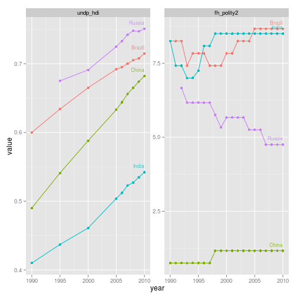

<!--
%\VignetteEngine{knitr::knitr}
%\VignetteIndexEntry{rqog Markdown Vignette made with knitr}
-->

rqog - Download data from the Quality of Government Institute data
===========


## Installation


```r
library(devtools)
install_github(repo = "rQog", username = "muuankarski")
library(rQog)
```


Developers (Github development version):


```r
library(rQog)
dat <- read_qog(which.data = "basic", data.dir = "~/temp/")
```

```
## Reading local file from ~/temp//qog_bas_ts_30aug13.csv
```

```r
dat2 <- dat[dat$cname %in% c("Russia", "China", "India", "Brazil"), ]
dat2 <- dat2[c("cname", "year", "undp_hdi", "fh_polity2")]
dat2 <- dat2[dat2$year %in% 1990:2010, ]
# melt to long format
library(reshape2)
dat.l <- melt(dat2, id.vars = c("cname", "year"))
dat.l <- dat.l[!is.na(dat.l$value), ]
library(ggplot2)
# Plot the data
ggplot(dat.l, aes(x = year, y = value, color = cname)) + geom_point() + geom_line() + 
    geom_text(data = merge(dat.l, aggregate(year ~ cname, dat.l, max), by = c("year", 
        "cname")), aes(x = year, y = value, label = cname), hjust = 1, vjust = -1, 
        size = 3, alpha = 0.8) + facet_wrap(~variable, scales = "free") + theme(legend.position = "none")
```

 

```r

```


